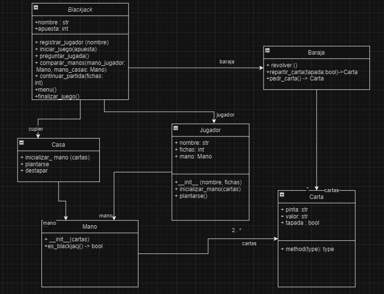

## Requisitos Funcionales

### R1 - Registrar Jugador

- **Resumen**: El sistema debe permitir registrar un jugador para poder iniciar un juego.
- **Entradas**: Nombre del Jugador.
- **Resultado**:
  1. El sistema muestra un mensaje dando la bienvenida al jugador.
  2. El sistema carga 100 fichas al jugador.
  3. El sistema le muestra el menú con la opción para iniciar un nuevo juego.

#### Pasos
| Paso               | Métodos                        | Responsable |
|--------------------|--------------------------------|-------------|
| Registrar Jugador  | registrar_jugador(nombre)      | Blackjack   |
| Crear Jugador      | __init__(nombre, fichas)       | Jugador     |

### R2 - Iniciar Juego

- **Resumen**: El sistema permite iniciar un juego, repartiendo las cartas al jugador y la casa.
- **Entradas**: Apuesta (cantidad de fichas).
- **Resultado**:
  1. El sistema recibe la apuesta del jugador.
  2. Revolver las cartas.
  3. El sistema reparte dos cartas destapadas al jugador.
  4. El sistema reparte dos cartas a la casa, una destapada y la otra tapada.
  5. El sistema verifica si la mano del jugador es blackjack:
     - Si tiene blackjack, se ejecuta el requisito R5 Finalizar juego.
     - Si no tiene blackjack, se ejecuta el requisito R3 Hacer jugada jugador.

#### Pasos
| Paso               | Métodos                        | Responsable |
|--------------------|--------------------------------|-------------|
| Iniciar Juego      | Iniciar_juego(apuesta)         | Blackjack   |
| Revolver las Cartas| revolver()                     | Baraja      |
| Repartir Carta     | repartir_carta(tapada: bool)   | Baraja      |
| Iniciar la Mano    | inicializar_mano(cartas)       | Casa, Jugador|
| Crear Mano         | __init__(carta)                | Mano        |
| Verificar si la Mano es Blackjack | es_blackjack()         | Mano |

### R3 - Hacer Jugada del Jugador

- **Resumen**: El sistema debe permitir que el jugador realice una jugada durante su turno.
- **Entradas**: Tipo de jugada (pedir carta o plantarse).
- **Resultado**:
  1. El sistema solicita al jugador que seleccione una jugada.
  2. Si el jugador pide una carta:
     - El sistema le reparte una carta a la mano del jugador.
     - Si el valor de la mano del jugador es mayor a 21, se ejecuta el requisito R5 Finalizar juego.
     - Si el valor de la mano no supera 21, se vuelve a ejecutar el requisito R3.
  3. Si el jugador se planta:
     - Se calcula el valor de la mano, se muestra y se guarda.
     - Se ejecuta el requisito R4 hacer jugada de la casa.

#### Pasos
| Paso               | Métodos                        | Responsable |
|--------------------|--------------------------------|-------------|
| Solicitar Jugada   | preguntar_jugada()             | BlackJack   |
| Solicitar Carta    | solicitar_carta() -> Carta     | Baraja      |
| Plantarse          | plantarse()                    | Jugador     |

### R4 - Hacer Jugada de la Casa

- **Resumen**: El sistema debe permitir que la casa realice una jugada durante su turno.
- **Entradas**: Ninguna.
- **Resultado**:
  1. Destapar la carta oculta de la casa.
  2. Si la mano de la casa es blackjack, se ejecuta el requisito R5 Finalizar juego (la casa gana).
  3. Si la mano de la casa no es blackjack:
     - Si la mano de la casa es menor o igual a 16 y menor que la mano del jugador:
       - Se reparte una carta a la mano de la casa.
       - Se calcula el valor de la mano y se vuelve a evaluar.
     - Si la mano de la casa es mayor a 16 y menor o igual a 21, se ejecuta el requisito R5 Finalizar juego.
     - Si la mano de la casa se pasó de 21, se ejecuta el requisito R5 Finalizar juego.

#### Pasos
| Paso               | Métodos                        | Responsable |
|--------------------|--------------------------------|-------------|
| Destapar Carta     | destapar()                     | Casa        |
| Verificar Blackjack| Se llama al método es_blackjack() de R2| Mano   |
| Jugada de la Casa  | jugada_casa() -> Mano           | Casa        |

### R5 - Finalizar Juego

- **Resumen**: El sistema debe permitir que se finalice la partida y se determine el ganador.
- **Entradas**: Ninguna.
- **Resultado**:
  1. El sistema compara las manos del jugador y de la casa.
  2. Si el jugador tiene blackjack, su mano es mayor que la mano de la casa o la mano de la casa superó 21:
     - El sistema anuncia al jugador como ganador.
     - Se duplican las fichas de la apuesta realizada.
  3. Si la casa tiene blackjack, su mano es mayor que la mano del jugador o la mano del jugador superó 21:
     - El sistema anuncia que el jugador perdió.
     - Se restan las fichas de la apuesta de las fichas del jugador.
  4. Si la mano del jugador y la mano de la casa tienen el mismo valor:
     - El sistema anuncia empate.
     - Se devuelven las fichas apostadas al jugador.
  5. Si el usuario tiene fichas disponibles:
     - Se presenta un menú con las opciones para iniciar un nuevo juego (R2) o salir de la aplicación.
  6. Si el usuario no tiene fichas disponibles, se termina la aplicación.

#### Pasos
| Paso               | Métodos                        | Responsable |
|--------------------|--------------------------------|-------------|
| Comparar Manos     | comparar_manos(mano_jugador: Mano, mano_casa: Mano)| BlackJack |
| Continuar Partida  | Continuar_partida(fichas: int) | BlackJack   |
| Presentar Menú     | menu()                         | BlackJack   |
| Finalizar Juego    | finalizar_juego()              | BlackJack   |

## Modelo del Mundo

- **Blackjack**: El sistema de juego en sí.
- **Jugador**: Representa a un jugador con fichas y un nombre.
  - Atributos: Fichas, Nombre.
- **Carta**: Las cartas utilizadas en el juego, con pinta y valor.
  - Atributos: Pinta, Valor.
- **C

